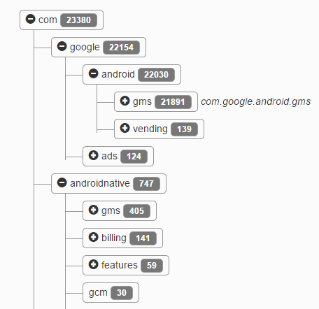
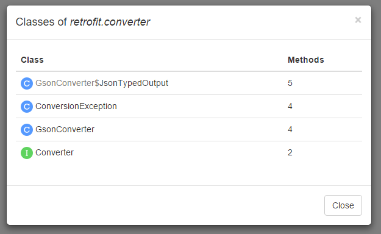

APK method count
============
####[Deprecated - use official [APK analyzer](https://developer.android.com/studio/build/apk-analyzer.html)]

*Output per-package method counts. Supports [multidex](https://developer.android.com/tools/building/multidex.html).*

Also you can now view per-class method counts for more detailed analysis. Inline classes are showed in this format: *ParentClass$InlineClass*. Anonymous classes are in this format: *(anon-cls-ID)*.

It's written in TypeScript, If you want contribute - create a pull request or create an issue (If you have an idea or have you found an issue).

###License
    Licensed under the Apache License, Version 2.0 (the "License");
    you may not use this file except in compliance with the License.
    You may obtain a copy of the License at
    
    http://www.apache.org/licenses/LICENSE-2.0
    
    Unless required by applicable law or agreed to in writing, software
    distributed under the License is distributed on an "AS IS" BASIS,
    WITHOUT WARRANTIES OR CONDITIONS OF ANY KIND, either express or implied.
    See the License for the specific language governing permissions and
    limitations under the License.
